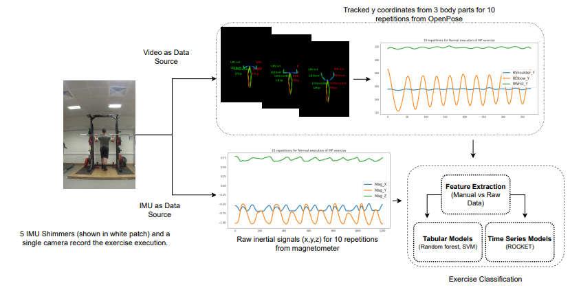

# [An Examination of Wearable Sensors versus Video Data Capture for Human Exercise Classification](https://arxiv.org/abs/2307.04516)

Wearable sensors such as Inertial Measurement Units (IMUs)
are often used to assess the performance of human exercise. Common
approaches use handcrafted features based on domain expertise or auto-
matically extracted features using tools for time series analysis. Multiple
sensors are required to achieve high classification accuracy, which is not
very practical. These sensors require calibration and synchronization and
may lead to discomfort over longer time periods. Recent work utilizing
computer vision techniques has shown similar performance using video,
without the need for manual feature engineering, and avoiding some pit-
falls such as sensor calibration and placement on the body. In this pa-
per, we compare the performance of IMUs to a video-based approach
for human exercise classification on two real-world datasets consisting
of Military Press and Rowing exercises. We compare the performance
using a single camera that captures video in the frontal view versus us-
ing 5 IMUs placed on different parts of the body. We observe that an
approach based on a single camera can outperform a single IMU by 10
percentage points on average. Additionally, a minimum of 3 IMUs are re-
quired to outperform a single camera. We observe that working with the
raw data using multivariate time series classifiers outperforms traditional
approaches based on handcrafted or automatically extracted features. Fi-
nally, we show that an ensemble model combining the data from a single
camera with a single IMU outperforms either data modality. Our work
opens up new and more realistic avenues for this application, where a
video captured using a readily available smartphone camera, combined
with a single sensor, can be used for effective human exercise classification.

[//]: # (![Alt text](figs/overview.png?raw=true))

<em>**Fig 1** Comparison of video (top) and sensors (bottom) to classify human exercise
movement. The upper box presents the process of obtaining multivariate data from
video (only 3 out of 25 body parts shown). The bottom box shows the raw Y-signals
from a single IMU placed on the participant’s body (only 3 signals shown here).</em>

## Data Description

The data used is the video recordings and IMU data of the execution of the Military Press (MP) and Rowing exercise.
Participants completed 10 repetitions of the normal form and 10 repetitions with induced deviations. We employ two
different ways to classify IMU and video data:

- Time series way
- Automated feature extraction

Raw data from IMUs can be treated as multivariate time series with multiple dimensions. Similarly, for video we
obtain multivariate time series by repeatedly applying OpenPose as human pose estimation library to track 25 body
parts of a human body over all the frames.
The TSC folder contains the data in time series for both IMUs and videos. The data shared in this repository in
data folder here is already pre-processed i.e. it is segmented, re-sampled to a length of 161 and split into a
ration of 70/30 for train/test.
Folder Manual contains features extracted using domain knowledge for IMUs in the tabular form. Folder Automated
contains tabular features created using libraries such as catch22 and tsfresh
For tabular features, also train/test has already been created in the ratio of 70/30 for train/test. Some folders
contain the pid file which basically maps each sample in the train/test to a unique participant id with a particular
exercise type and repetition number. This information can be used to create further splits. If some folders does
not contain this file it can be copied from other folder as the order of the features remain same. The data can be
downloaded from the Google
Drive [link](https://drive.google.com/drive/folders/1IoX5-GoO9w6PP1juUKnsrl6Ymn-BjiEY?usp=sharing).

## Comparison of IMUs, Video and Ensemble based approach

| Data Source                            | Acc MP | Acc Rowing |
|----------------------------------------|--------|------------|
| Placement of IMUs                      |        |            |
| 3 IMUs (Wrists and Back)               | 0.91   | 0.80       |
| 1 IMU (LeftWrist)                      | 0.84   | 0.70       |
| Video                                  |        |            | 
| 25 body parts                          | 0.82   | 0.79       |
| 8 body parts                           | 0.88   | 0.83       |
| Ensemble: video and IMUs               |        |            |
| Video (8 body parts) + 3 IMUs          | 0.93   | 0.88       |
| Video (8 body parts) + 1 IMU LeftWrist | 0.93   | 0.87       |

<em>Table 3: Comparison of accuracy obtained using IMUs and video for MP and Rowing. </em>

Table 3 presents the results for IMU and Video for both MP and Rowing exercises. We observe that a minimum of 3 IMUs
are required to achieve a higher accuracy than a single video. A single video outperforms the accuracy of using a single
IMU for both exercises. Finally, an ensemble approach outperforms either standalone approaches by a minimum of 2
percentage points.